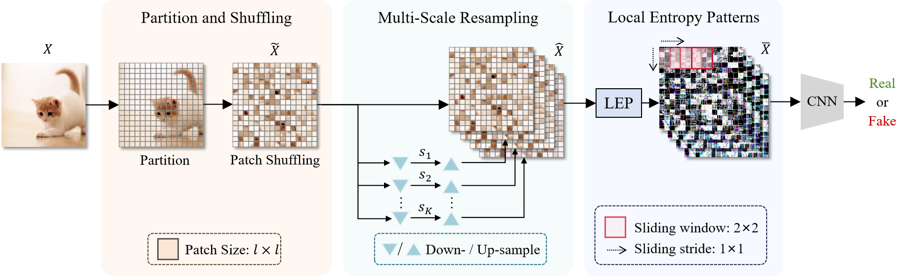

# MLEP: Multi-granularity Local Entropy Patterns for Generalized Al-generated lmage Detection
Official github repository for the article [MLEP: Multi-granularity Local Entropy Patterns for Generalized Al-generated lmage Detection](https://arxiv.org/abs/2504.13726), which was accepted by NeurIPS 2025.

<p align="center"></p>

<p align="center">
    <strong>Lin Yuan, Xiaowan Li, Yan Zhang<sup>*</sup>, Jiawei Zhang, Hongbo Li, Xinbo Gao<sup>*</sup></strong>
</p>
<p align="center">
    <strong>Chongqing Key Laboratory of Image Cognition, Chongqing University of Posts and Telecommunications</strong>
</p>

<p align="center">
    <a href='https://arxiv.org/abs/2504.13726'>
      
         </a>
    
## Environment Setup
```sh
conda env create -f environment.yaml
```
Due to the large number of environment packages, the "solving environment" step of creating environment may be time-consuming.

## Getting the  Datasets
### Test Datasets
The test datasets we use can all be found at [NPR 2024 CVPR](https://github.com/chuangchuangtan/NPR-DeepfakeDetection).
You can also create your own dataset to test, just follow a similar folder structure below, and modify the dataroot in 'test.py'.

### Train Datasets
We use the same training dataset as NPR, which includes four types of images (car, cat, chair, horse) generated by ProGAN. The specific dataset can be obtained at [NPR 2024 CVPR](https://github.com/chuangchuangtan/NPR-DeepfakeDetection).

## Directory structure
<details>
<summary> Click to expand the folder tree structure. </summary>

```
datasets
|-- TrainDatasets
|   |-- train
|   |-- val
|   `-- test
`-- TestDatasets
    |-- GAN-set-1        # Set1
    |   |-- biggan
    |   |-- cyclegan
    |   |-- gaugan
    |   |-- progan
    |   |-- stargan
    |   |-- stylegan
    |   `-- stylegan2
    |-- GAN-set-2        # Set2
    |   |-- AttGAN
    |   |-- BEGAN
    |   |-- CramerGAN
    |   |-- InfoMaxGAN
    |   |-- MMDGAN
    |   |-- RelGAN
    |   |-- S3GAN
    |   |-- SNGAN
    |   `-- STGAN
    `-- Diffusion-set    # Set3
        |-- adm
        |-- DALLE
        |-- dalle_mini
        |-- ddpm
        |-- glide_100_10
        |-- glide_100_27
        |-- glide_50_27
        |-- iddpm
        |-- ldm
        |-- ldm_200
        |-- ldm_200_cfg
        |-- midjourney
        |-- pndm
        |-- sdv1_new
        |-- sdv2
        `-- vqdiffusion

```
</details>

Further down are the '0_real' and '1_fake' folders.

## Repository layout

This fork is packaged. Everything importable lives under `src/mlep/`:

```
src/mlep/
  networks/     the entropy front-end + truncated ResNet (resnet.py)
  data/         dataset construction and the blur/JPEG/WebP corruptions
  options/      upstream argument parsing
  harness/      shared machinery: device.py, data.py, model.py,
                evaluate.py, report.py
  experiments/  windows.py (the sweep), entropy.py, degradation.py,
                perturbation4.py (the 4-output retrain)
  evaluation/   scoring trained checkpoints on the test generators
  upstream/     the original MLEP entry points, unchanged in behaviour
scripts/        dataset download/staging and result aggregation
tests/          77 regression tests
results/        reports and metrics (the record; kept in git)
checkpoints/    best + resume checkpoints (see .gitignore)
docs/           dataset subset documentation
paper/          the thesis chapter (EN + RO)
```

`run.sh` is the driver and needs no install — it puts `src/` on `PYTHONPATH`
itself:

```sh
./run.sh list          # every config in the registry
./run.sh test          # the 77 regression tests (~10 s, no dataset needed)
./run.sh smoke         # ~2 min GPU end-to-end check
./run.sh sweep         # the window/robustness sweep
./run.sh entropy       # experiment group 1: entropy functionals
./run.sh degradation   # experiment group 2: degradation heads
./run.sh pert4         # the 4-output retrain (clean/blur/jpeg/noise)
./run.sh headtest      # score the blur/jpeg/noise heads on TestDatasets
```

The `python -m mlep.…` forms below need the package importable. Either install
it once, which also gives you console entry points (`mlep-sweep`,
`mlep-pert4-train`, `mlep-pert4-eval`, `mlep-eval-model`, `mlep-eval-perturb`):

```sh
pip install -e .
```

…or prefix the command with `PYTHONPATH=src`, which is exactly what `run.sh`
does for you.

### Old → new commands

| Before | Now |
|---|---|
| `python experiment_windows.py …` | `python -m mlep.experiments.windows …` or `./run.sh sweep` |
| `python train_perturbation4.py …` | `python -m mlep.experiments.perturbation4 …` or `./run.sh pert4` |
| `python scripts/eval_pert4_heads.py …` | `python -m mlep.evaluation.pert4_heads …` or `./run.sh headtest` |
| `python scripts/eval_trained_model.py …` | `python -m mlep.evaluation.trained_model …` |
| `python scripts/eval_perturbations.py …` | `python -m mlep.evaluation.perturbations …` |
| `python train.py …` | `python -m mlep.upstream.train …` |
| `python test.py …` | `python -m mlep.upstream.test …` |
| `TrainedModelResults/` | `results/trained_model/` |

## Training
Download the training datasets and modify the dataroot:
```sh
python -m mlep.upstream.train --name 4class-resnet50 --dataroot ./datasets/TrainDatasets --classes car,cat,chair,horse --batch_size 32 --delr_freq 10 --lr 0.0002 --niter 100
```
## Testing

Download the testing datasets, then run (set `MLEP_DATASETS_ROOT` if they live
elsewhere):
```sh
python -m mlep.upstream.test --model_path ./pretrained/model_epoch_best.pth --batch_size 64
```

## Recovery

Everything except the datasets is in git. To rebuild this project from scratch
on a new machine:

```sh
git clone git@github.com:MateiT/MLEP_improvements.git && cd MLEP_improvements
conda env create -f environment.yaml && conda activate MLEP
pip install -e .                      # optional; run.sh works without it
./run.sh test                         # 77 tests, no dataset required
```

Then restore the data (~60 GB, the only thing not in git):

```sh
python scripts/fetch_half_dataset.py datasets/TrainDatasets/train   # ~37 GB
bash   scripts/datasets/download_train_valset.sh                    # ~0.8 GB
bash   scripts/datasets/download_train_testset.sh                   # ~23 GB
python scripts/verify_half_subset.py                                # checks the subset rule
```

What comes straight from the clone: all source, the 77 tests, every experiment
report and metrics CSV under `results/`, the training logs, both trained
lineages' best checkpoints plus the decay run's resume state, the released
`pretrained/model_epoch_best.pth`, and the thesis chapter.

What is deliberately **not** tracked, and how to regenerate it: the datasets
(above); per-image `*_predictions.csv` and entropy `*_features.csv` (re-run the
experiment that wrote the report next to them); intermediate-epoch checkpoints
(retrain, or resume from the kept ones). See `.gitignore`, which lists the rule
for each.

The half-size training subset is documented in
[docs/DATASET_SUBSET.md](docs/DATASET_SUBSET.md) — it is a deterministic rule,
not a random sample, so `fetch_half_dataset.py` reproduces the exact same
360,040 images.

## Acknowledgements
Our code is developed based on [CNNDet 2020 CVPR](https://github.com/peterwang512/CNNDetection), [NPR 2024 CVPR](https://github.com/chuangchuangtan/NPR-DeepfakeDetection). Thanks for their sharing codes and models.
